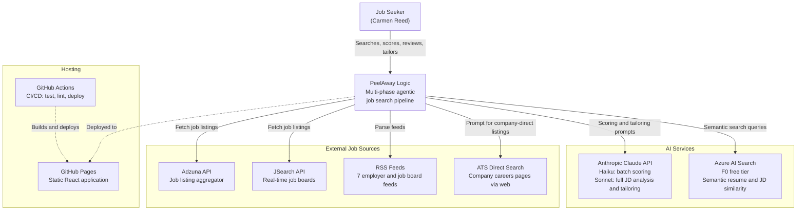
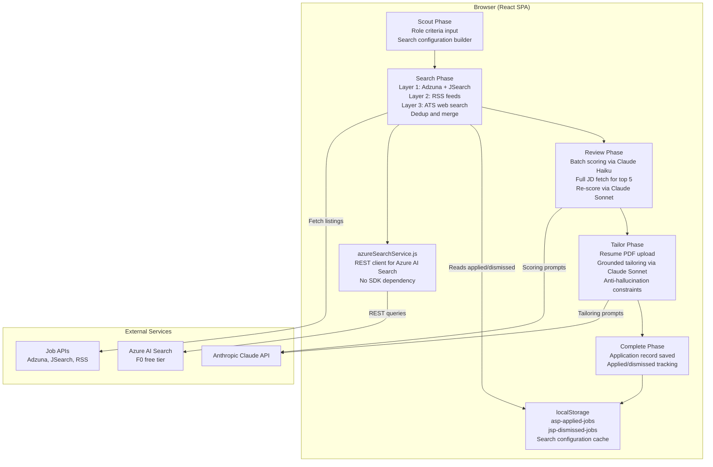
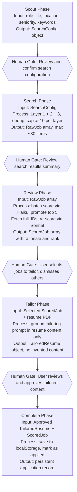
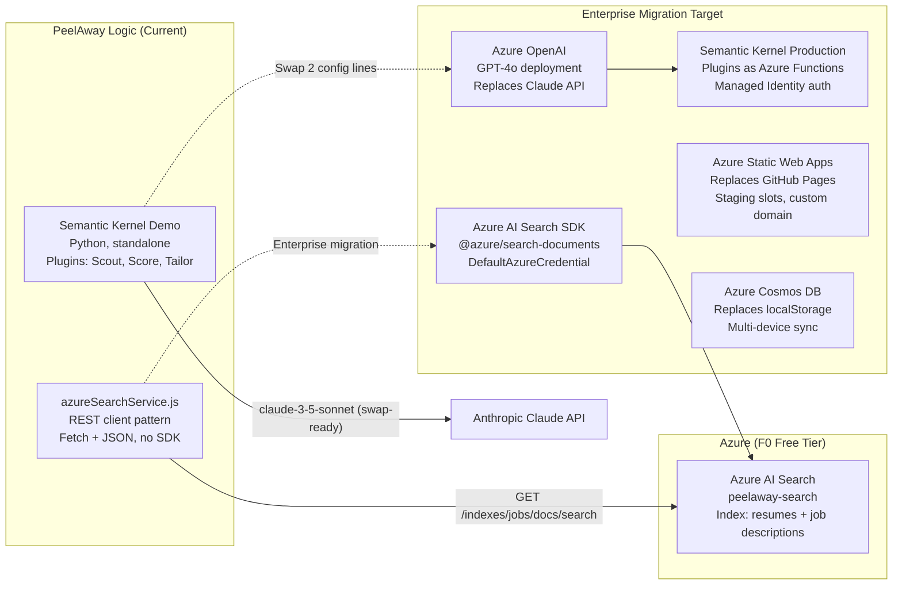
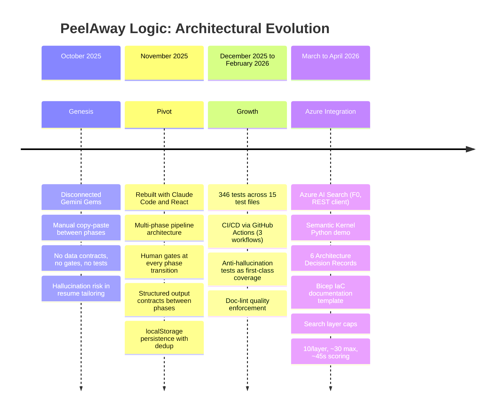

# PeelAway Logic: Architecture Overview

**Author:** Carmen Reed  
**Date:** April 12, 2026  
**Standard:** C4 Model (Context, Container, Component, Code)  
**Diagrams:** Mermaid (rendered in GitHub, VS Code, and Mermaid Live Editor)

---

## System Context (C4 Level 1)

The outermost view: PeelAway Logic in its ecosystem, showing the user and all external systems it depends on.

---

## Container Diagram (C4 Level 2)

The internal structure of PeelAway Logic: what runs where, what stores what, and how the parts communicate.

---

## Pipeline Data Flow

The data contract between phases: what goes in, what comes out, and where the human gates sit.

---

## Azure Integration Architecture

How Azure AI Search and the Semantic Kernel demo fit into the system.

---

## Evolution Timeline

The architectural journey from disconnected AI tools to a governed agentic pipeline.

---

## Architecture Decisions

All architectural decisions are documented as ADRs in [decisions/](./decisions/).

| ADR | Decision | Status |
|---|---|---|
| [ADR-001](./decisions/ADR-001-claude-over-azure-openai.md) | Anthropic Claude over Azure OpenAI, with swap-ready design | Accepted |
| [ADR-002](./decisions/ADR-002-rest-client-over-sdk.md) | Client-side REST over Azure SDK | Accepted |
| [ADR-003](./decisions/ADR-003-human-gated-pipeline.md) | Human-gated pipeline over fully autonomous agents | Accepted |
| [ADR-004](./decisions/ADR-004-project-evolution-strategy.md) | Refactor from Gemini Gems to agentic architecture | Accepted |
| [ADR-005](./decisions/ADR-005-github-pages-hosting.md) | GitHub Pages over Azure Static Web Apps | Accepted |
| [ADR-006](./decisions/ADR-006-anti-hallucination-strategy.md) | Black-box deficiency prompt engineering strategy | Accepted |

---

## Standalone Diagram Files

Each diagram above is also available as a standalone `.mermaid` file in [diagrams/](./diagrams/) for use in documentation pipelines, presentation tools, and diagram renderers that accept raw Mermaid source.

| File | Diagram |
|---|---|
| [system-context.mermaid](./diagrams/system-context.mermaid) | C4 Level 1: System Context |
| [container-diagram.mermaid](./diagrams/container-diagram.mermaid) | C4 Level 2: Container Diagram |
| [pipeline-data-flow.mermaid](./diagrams/pipeline-data-flow.mermaid) | Pipeline Data Flow with Human Gates |
| [azure-integration.mermaid](./diagrams/azure-integration.mermaid) | Azure Integration and Enterprise Migration |
| [evolution-timeline.mermaid](./diagrams/evolution-timeline.mermaid) | Architectural Evolution Timeline |
