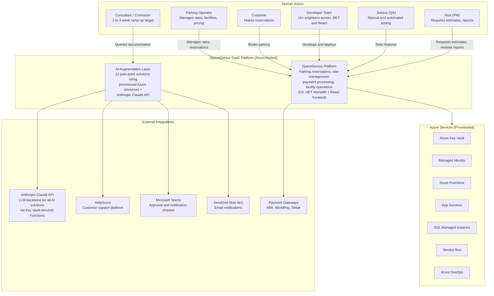

# SpaceGenius AI-Augmented Architecture Overview

**Author:** Carmen Reed  
**Date:** April 12, 2026  
**Standard:** C4 Model (Context, Container, Component)  
**Diagrams:** Mermaid (rendered in GitHub, VS Code, and Mermaid Live Editor)  
**Scope:** Production architecture with AI augmentation layer. All solutions constrained to provisioned Azure resources.

---

## System Context (C4 Level 1)

SpaceGenius in its ecosystem: the parking management SaaS platform, its external actors, and the AI augmentation points operating within current Azure constraints.

---

## Container Diagram (C4 Level 2)

The internal structure of the SpaceGenius platform: compute, data, messaging, and AI augmentation integration points.

```mermaid
graph TB
    subgraph AzureSubscription["Azure Subscription (SpaceGenius)"]

        subgraph Compute["Compute Layer"]
            API[".NET Web API\n(App Service)\nCore business logic\nRate management\nReservation processing"]
            Frontend["React Frontend\n(App Service)\nOperator UI\nCustomer-facing web app"]
            Functions["Azure Functions\n(Consumption Plan)\nHTTP triggers: SDLC automation\nHTTP triggers: NLP endpoints\nTimer triggers: pricing intelligence\nService Bus triggers: event pipeline"]
        end

        subgraph AI["AI Augmentation Layer (within Functions)"]
            DocPipeline["Documentation Pipeline\nMeeting transcript to BRD/FRD/LOE/Gherkin ACs\nADR-001"]
            EstimationSvc["Estimation Intelligence\nADO Analytics OData + velocity grounding\nADR-002"]
            DedupSvc["Backlog Dedup\n90-day semantic comparison\nADR-003"]
            TriageSvc["Support Triage Chain\nHelpScout to ADO with Gherkin ACs\nADR-004"]
            PricingSvc["Dynamic Pricing\nSQL MI trend analysis + Teams approval\nADR-009"]
            NLPRate["NLP Rate Management\nStructured ChangeSet output + human gate\nADR-007"]
            NLRes["Natural Language Reservations\nSlot-filling to booking API\nADR-008"]
        end

        subgraph Security["Security Layer"]
            KV["Azure Key Vault\nAPI keys: Claude, HelpScout, SendGrid\nPAT: ADO REST\nDB credentials: SQL MI"]
            MI["Managed Identity\nAll service-to-service auth\nFetches secrets from Key Vault"]
        end

        subgraph Data["Data Layer"]
            SQLMI["SQL Managed Instance\nTransactions, occupancy, rates\nReservation history\nOperator and facility data"]
        end

        subgraph Messaging["Messaging Layer"]
            SB["Service Bus\n(Standard Namespace)\nExisting: inter-service events\nNew: ticket-triage topic\nNew: support-triage topic"]
        end

        subgraph DevOps["DevOps Layer"]
            ADOCI["Azure DevOps Pipelines\nCI/CD all environments\nADO Boards: work items\nADO Analytics: OData feed\nADO Wiki: generated docs"]
        end

    end

    subgraph ClaudeOuter["External AI"]
        ClaudeAPI["Anthropic Claude API\nLLM backbone via Key Vault-secured Function\nSwap-ready for Azure OpenAI\n(ADR-001 through ADR-012)"]
    end

    MI -->|"Fetches secrets"| KV
    Functions -->|"Managed Identity auth"| KV
    API -->|"Managed Identity auth"| KV
    Functions -->|"Queries and writes"| SQLMI
    API -->|"Queries and writes"| SQLMI
    Functions -->|"Publishes and subscribes"| SB
    Functions -->|"REST API (PAT from Key Vault)"| ADOCI
    API -->|"REST API"| ADOCI
    Functions -->|"API key from Key Vault"| ClaudeAPI

    DocPipeline --> Functions
    EstimationSvc --> Functions
    DedupSvc --> Functions
    TriageSvc --> Functions
    PricingSvc --> Functions
    NLPRate --> API
    NLRes --> Functions
```

---

## AI Augmentation Points

Each of the 12 pain points maps to a specific container and integration pattern. All solutions use only provisioned Azure resources.

| # | Pain Point | Container | Integration Pattern | ADR |
|---|---|---|---|---|
| 1 | Documentation pipeline | Azure Functions (HTTP) | Transcript to Claude API to ADO REST | [ADR-001](./decisions/ADR-001-documentation-pipeline.md) |
| 2 | Unpredictable estimates | Azure Functions (HTTP) | ADO Analytics OData + Claude API to PBI comment | [ADR-002](./decisions/ADR-002-estimate-intelligence.md) |
| 3 | Backlog dedup | Service Bus + Functions | ADO webhook to SB topic to Claude API semantic check | [ADR-003](./decisions/ADR-003-backlog-dedup.md) |
| 4 | Support ticket triage | Service Bus + Functions chain | HelpScout webhook to SB to 3-Function pipeline | [ADR-004](./decisions/ADR-004-support-triage.md) |
| 5 | QA automation | Claude Code + ADO Pipelines | Slash command reads Gherkin ACs, generates Playwright | [ADR-005](./decisions/ADR-005-qa-automation.md) |
| 6 | Consultant onboarding | ADO Pipelines + Functions | Post-deploy hook updates CLAUDE.md knowledge base | [ADR-011](./decisions/ADR-011-onboarding-living-docs.md) |
| 7 | Developer productivity | Claude Code + Key Vault MCP | Slash commands: /create-pr, /update-ticket | [ADR-006](./decisions/ADR-006-developer-productivity.md) |
| 8 | Payment integrations | Claude Code + CLAUDE.md | Black-box deficiency pattern + NMI reuse | [ADR-012](./decisions/ADR-012-payment-integrations.md) |
| 9 | Rate page NLP | App Services (new route) | Claude API structured ChangeSet output + human gate | [ADR-007](./decisions/ADR-007-nlp-rate-management.md) |
| 10 | NL reservations | Azure Functions (HTTP) | Slot-filling prompt to structured reservation params | [ADR-008](./decisions/ADR-008-natural-language-reservations.md) |
| 11 | Dynamic pricing | Azure Functions (timer) | SQL MI query + Claude API + Teams webhook approval | [ADR-009](./decisions/ADR-009-dynamic-pricing.md) |
| 12 | Legacy .NET modernization | Claude Code + ADO Pipelines | CLAUDE.md audit + ARM parameterization + multi-target build | [ADR-010](./decisions/ADR-010-legacy-modernization.md) |

---

## Architecture Decision Records

All 12 solutions have a corresponding ADR with explicit trade-off analysis, alternatives considered, and an Azure Migration Path section showing what changes with full Azure AI platform access. All ADRs were documented in April 2026; the underlying decisions were made over the preceding 18 months of production AI work.

| ADR | Decision | Status |
|---|---|---|
| [ADR-001](./decisions/ADR-001-documentation-pipeline.md) | Azure Function + Claude API over Logic Apps + AI Foundry | Accepted |
| [ADR-002](./decisions/ADR-002-estimate-intelligence.md) | ADO Analytics OData over Power BI / Fabric | Accepted |
| [ADR-003](./decisions/ADR-003-backlog-dedup.md) | Claude API in-context over Azure AI Search vector index | Accepted |
| [ADR-004](./decisions/ADR-004-support-triage.md) | Chained Functions over Logic Apps native connectors | Accepted |
| [ADR-005](./decisions/ADR-005-qa-automation.md) | Claude Code slash command over Copilot Enterprise | Accepted |
| [ADR-006](./decisions/ADR-006-developer-productivity.md) | CLAUDE.md + Claude Code over Copilot Enterprise | Accepted |
| [ADR-007](./decisions/ADR-007-nlp-rate-management.md) | Claude API structured output over Semantic Kernel function calling | Accepted |
| [ADR-008](./decisions/ADR-008-natural-language-reservations.md) | Functions HTTP slot-filling over Copilot Studio | Accepted |
| [ADR-009](./decisions/ADR-009-dynamic-pricing.md) | SQL MI + Claude API over Microsoft Fabric + Azure OpenAI | Accepted |
| [ADR-010](./decisions/ADR-010-legacy-modernization.md) | ARM parameterization over full Bicep migration | Accepted |
| [ADR-011](./decisions/ADR-011-onboarding-living-docs.md) | CLAUDE.md auto-update over Azure AI Foundry RAG | Accepted |
| [ADR-012](./decisions/ADR-012-payment-integrations.md) | CLAUDE.md integration library over AI Foundry prompt flow | Accepted |

---

## Current Azure Environment Summary

| Resource | Status | Role in AI Solutions |
|---|---|---|
| Key Vault + Managed Identity | Provisioned | Credential store for all API keys; no secrets in code |
| Azure Functions | Provisioned | Execution layer for all SDLC automation |
| App Services | Provisioned | Hosts .NET API and React frontend; NLP route for rate management |
| SQL Managed Instance | Provisioned | Data source for dynamic pricing intelligence |
| Service Bus | Provisioned | Event routing for ticket dedup and support triage |
| Azure DevOps | Provisioned | CI/CD, REST API for ADO integration, Analytics OData |
| Azure OpenAI | Not provisioned | All LLM calls use Claude API via Functions; swap-ready |
| Azure AI Foundry | Not provisioned | CLAUDE.md + slash commands are the functional equivalent |
| Azure AI Search | Not provisioned | In-context Claude API comparison with 90-day scope limit |
| Logic Apps | Not provisioned | Chained Functions in C#/.NET replicate the orchestration pattern |
| GitHub Copilot Enterprise | Not provisioned | Claude Code + hand-authored CLAUDE.md per project |
| Microsoft Fabric | Not provisioned | SQL MI views + Claude API reasoning replace the ML pipeline |

Full analysis: [AZURE_ENVIRONMENT_INVENTORY.md](./AZURE_ENVIRONMENT_INVENTORY.md)

---

## Technology Stack

| Category | Technology | Notes |
|---|---|---|
| Backend | C# / .NET | ASP.NET Web API, targeting .NET 8 (modernization in progress) |
| Frontend | React | Operator dashboard and customer-facing reservation flow |
| Database | SQL Server / SQL Managed Instance | Business Critical SKU; Managed Identity auth |
| Functions | Azure Functions (Consumption) | HTTP, timer, and Service Bus triggers |
| Messaging | Azure Service Bus | Standard namespace; extended with new topics per ADR-003, ADR-004 |
| IaC | ARM template | Single non-modular file; environment parameterization per ADR-010 |
| LLM | Anthropic Claude API | Via Key Vault-secured Functions; swap-ready for Azure OpenAI |
| AI development tooling | Claude Code + CLAUDE.md | Repo context, slash commands, Key Vault MCP credential injection |
| CI/CD | Azure DevOps Pipelines | Multi-target build (net8.0 + net10.0); PAT-authenticated ADO REST |
| Secrets | Azure Key Vault + Managed Identity | All credentials stored in Key Vault; no secrets in code or pipelines |

---

## External Dependencies and Data Considerations

All 12 AI solutions depend on the Anthropic Claude API as the LLM backbone. Production deployment requires retry logic with backoff for Claude API calls and graceful degradation when the API is unavailable or returns malformed responses. Solutions with existing non-AI fallback paths (ADR-008: form-based reservation flow) degrade naturally; solutions without a non-AI equivalent (ADR-001: documentation pipeline) queue inputs for processing when the API recovers.

Customer-facing AI features that send business data to Anthropic servers (ADR-007: rate management, ADR-008: reservation data, ADR-009: pricing data) require data classification review and Anthropic DPA verification before production deployment. The enterprise vision migration to Azure OpenAI (ENTERPRISE_VISION.md) eliminates third-party data egress entirely by keeping all LLM processing within the Microsoft tenant.

---

## Diagram Cross-Reference

| Diagram | Description |
|---|---|
| [01-current-azure-topology.md](./diagrams/01-current-azure-topology.md) | Azure resources provisioned today: the constraint map |
| [02-ai-augmented-sdlc.md](./diagrams/02-ai-augmented-sdlc.md) | Before and after: how AI transforms each SDLC phase |
| [03-service-bus-event-chain.md](./diagrams/03-service-bus-event-chain.md) | Service Bus extension: ticket-triage and support-triage pipelines |
| [04-full-azure-vision.md](./diagrams/04-full-azure-vision.md) | Target state: full Azure AI platform, no constraints |

---

## Related Documentation

| Document | Description |
|---|---|
| [SOLUTION_ARCHITECTURE.md](./SOLUTION_ARCHITECTURE.md) | All 12 pain points: constrained solution and enterprise vision side by side |
| [ENTERPRISE_VISION.md](./ENTERPRISE_VISION.md) | Full Azure AI target state when budget approval arrives |
| [AZURE_ENVIRONMENT_INVENTORY.md](./AZURE_ENVIRONMENT_INVENTORY.md) | Current Azure asset analysis and leverage map |
| [AI_TRANSFORMATION_ROADMAP.md](../../AI_TRANSFORMATION_ROADMAP.md) | Phased 12-month implementation plan |
| [../GOVERNANCE.md](../GOVERNANCE.md) | Documentation standards and quality gates |
