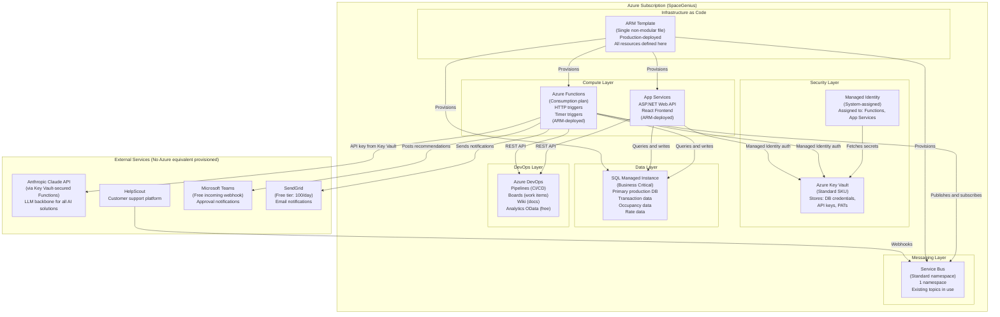

# Diagram 01: SpaceGenius Current Azure Topology

**Purpose:** Shows the Azure resources provisioned today. This is the constraint map: every AI solution must work within these boundaries for Phase 1 through Phase 4 of the transformation roadmap.

---

---

## What Is Missing (and Why It Matters)

| Missing | Impact on AI Solutions | Workaround in ADRs |
|---|---|---|
| Azure OpenAI | All LLM calls exit to Anthropic servers | Claude API via Functions with Key Vault security; swap-ready architecture (ADR-007, ADR-009, ADR-012) |
| Azure AI Foundry | No org-wide versioned prompts or eval metrics | Claude Code CLAUDE.md + custom slash commands (ADR-001, ADR-006) |
| Azure AI Search | No persistent vector index; 90-day scope limit on dedup | Claude API in-context comparison (ADR-003, ADR-011) |
| Logic Apps | Custom Function chains instead of visual workflows | Chained Functions in C#/.NET (ADR-004) |
| Copilot Enterprise | CLAUDE.md required for repo context | Hand-authored CLAUDE.md knowledge base (ADR-005, ADR-006) |
| Microsoft Fabric | No continuous ML improvement for pricing | Pre-aggregated SQL views + Claude API static analysis (ADR-009) |
| Copilot Studio | Single-exchange HTTP only; no multi-turn | Stateless Function with slot-filling prompt (ADR-008) |

**The gap between what is provisioned and what Microsoft full-platform provides is the business case for Phase 5 budget approval.**
