```mermaid
flowchart TD
    subgraph Before["Before: Current State (Manual)"]
        M1["Meeting occurs\nRequirements discussed verbally\nNo documentation produced"]
        M2["Developer manually writes\nBRD, FRD, LOE (sometimes)\nGherkin ACs (rarely)"]
        M3["Developer estimates\nbased on intuition\nRick holds team to ballpark"]
        M4["PBI created manually\nEmpty testing notes\nNo Gherkin ACs"]
        M5["QA tests manually\nScope unclear\nRegression coverage low"]
        M1 --> M2 --> M3 --> M4 --> M5
    end

    subgraph After["After: AI-Augmented SDLC"]

        A1["Meeting occurs\nTranscript captured"]

        subgraph DocPipeline["Documentation Pipeline (ADR-001)"]
            A2["Azure Function\nHTTP trigger"]
            A3["Claude API\nGenerates: BRD, FRD, LOE, Gherkin ACs"]
            A4["ADO REST API\nCreates PBI in design state\nAttaches docs as wiki pages"]
        end

        A5{{"Human Gate:\nTeam reviews and approves\ndocumentation before\nadvancing to ready"}}

        subgraph EstimationPipeline["Estimation Intelligence (ADR-002)"]
            A6["ADO Analytics OData\nHistorical velocity by task type"]
            A7["Claude API\nGranular estimate + confidence range"]
            A8["Posts structured estimate\nto ADO PBI comment"]
        end

        subgraph DevPhase["Development (ADR-006, ADR-007, ADR-008)"]
            A9["Developer codes with\nClaude Code + CLAUDE.md context\nKey Vault MCP injects credentials"]
            A10["/create-pr generates\nfull PR description from\ngit diff + ADO ticket"]
        end

        subgraph QAAutomation["QA Automation (ADR-005)"]
            A11["/generate-tests reads\nGherkin ACs from PBI\nGenerates Playwright test file"]
            A12["ADO Pipelines runs Playwright\nPass/fail posted back to PBI"]
        end

        A13{{"Human Gate:\nDeveloper reviews\nPR and test file\nbefore commit"}}

        A14["PBI moves to\ntest ready\nJessica has clear scope"]

        A1 --> A2 --> A3 --> A4 --> A5
        A5 --> A6 --> A7 --> A8
        A8 --> A9 --> A10 --> A13
        A5 --> A11 --> A12 --> A13
        A13 --> A14
    end
```

# Diagram 02: AI-Augmented SDLC Flow

**Purpose:** Shows how AI transforms each phase of the SpaceGenius software delivery lifecycle, from meeting to deployed feature. This is the value story for System Thinking assessment: the same engineering discipline applied at enterprise scale.

---

---

## Key Metrics: Before vs After

| Phase | Before | After |
|---|---|---|
| Documentation | Hours to days, often skipped | Minutes, auto-generated from meeting transcript |
| Gherkin ACs | Written by hand or absent | Generated by Claude API, reviewed by team |
| Estimation | Intuition-based ballpark | Velocity-grounded with confidence range |
| PR descriptions | Minimal or empty | Full description with ticket link and rationale |
| Development testing notes | Empty or post-hoc | Generated from CI test output |
| Playwright test file | Written after development | Generated from Gherkin ACs before development completes |
| QA scope clarity | Depends on what developer documented | Defined by Gherkin ACs and test results in ADO |

---

## Notes

All human gates are preserved. The SDLC does not automate human judgment out of the process. It automates the cognitive load of documentation, so that human review focuses on substance rather than transcription.

This is the Neuro-Inclusive Design principle at the SDLC level: AI handles executive-function tasks (documentation generation, test scaffolding, PR description writing) so that engineers focus on the work that requires human judgment (architecture decisions, code review, acceptance criteria validation).
