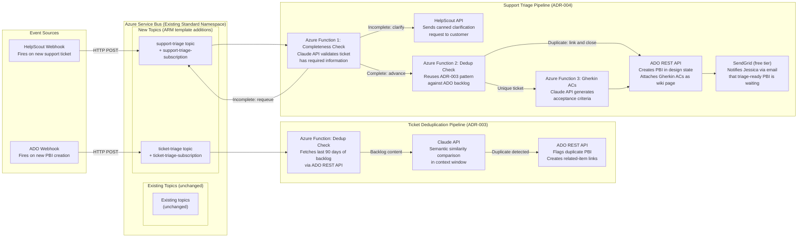

# Diagram 03: Service Bus Event Chain Architecture

**Purpose:** Shows how the existing Service Bus namespace is extended with new topics to power the ticket deduplication and support triage pipelines, without requiring a new Service Bus resource or tier upgrade.

---



---

## ARM Template Extensions Required

Two additions to the existing ARM template enable this architecture. No new Azure resources are provisioned outside the existing namespace.

```json
// Addition 1: ticket-triage topic
{
  "type": "Microsoft.ServiceBus/namespaces/topics",
  "name": "[concat(variables('serviceBusNamespaceName'), '/ticket-triage')]",
  "dependsOn": ["[variables('serviceBusNamespaceName')]"]
}

// Addition 2: support-triage topic  
{
  "type": "Microsoft.ServiceBus/namespaces/topics",
  "name": "[concat(variables('serviceBusNamespaceName'), '/support-triage')]",
  "dependsOn": ["[variables('serviceBusNamespaceName')]"]
}
```

Both topics use the Standard namespace tier already provisioned. No tier upgrade required. No new Azure cost.

---

## Notes

The Service Bus extension pattern is the principal architect answer to "I need a new messaging capability." The correct move is to extend the existing namespace with a new topic and subscription before requesting a new Service Bus resource. This is the constraint-first principle applied to infrastructure: use what is provisioned, extend it precisely, do not replace it.

The 90-day scope limit on the dedup function (Ticket Deduplication Pipeline) is an explicit architectural trade-off documented in ADR-003. It is represented here as a design parameter, not a bug.
