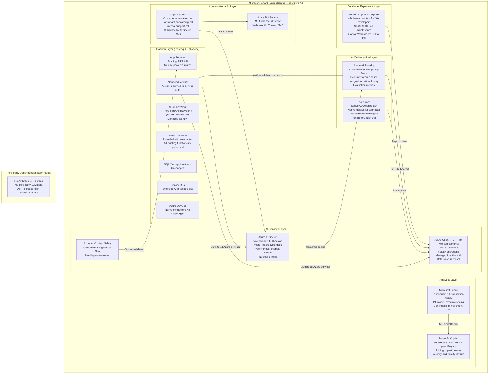

# Diagram 04: Full Azure AI Target State

**Purpose:** Shows the SpaceGenius architecture after full Azure AI platform adoption. No constraints. Every constrained solution upgraded to its enterprise target. This is the vision story and the business case for Phase 5 investment.

---

---

## Constrained Solution vs Enterprise Target: Summary

| Pain Point | Constrained Solution | Enterprise Target |
|---|---|---|
| Documentation pipeline | Azure Function + Claude API | AI Foundry prompt flow + Logic Apps + native ADO connector |
| Estimates | ADO Analytics OData + Claude API | Azure OpenAI fine-tuned on velocity + Power BI Copilot |
| Backlog dedup | Service Bus + Function + Claude API 90-day scope | Azure AI Search vector index, full backlog, no LLM token cost |
| Support triage | Chained Functions + Claude API | Logic Apps workflow + native connectors + Azure OpenAI |
| QA automation | Claude Code + CLAUDE.md + ADO Pipelines | Copilot Enterprise + Copilot Workspace |
| Living docs | CLAUDE.md + Claude Code CLI | AI Foundry RAG + AI Search vector index + Copilot Studio bot |
| Developer productivity | Claude Code slash commands + Key Vault MCP | Copilot Enterprise + Copilot Workspace (Key Vault MCP remains) |
| Payment integrations | Claude Code + CLAUDE.md pattern library | AI Foundry prompt flow, org-wide, with eval metrics |
| Rate page NLP | App Service route + Claude API JSON output | Azure OpenAI + Semantic Kernel function calling (strongly typed) |
| NL reservations | Azure Function + Claude API slot-filling | Copilot Studio + Azure OpenAI + Bot Service multi-channel |
| Dynamic pricing | SQL MI + Claude API + Teams webhook | Microsoft Fabric + Azure OpenAI fine-tuned + Power BI Copilot |
| Legacy modernization | Claude Code + ARM parameterization | Copilot Enterprise + .NET Upgrade Assistant + Bicep + Deployment Environments |

---

## Investment Summary for Phase 5 Approval Request

| Resource | Estimated Monthly Cost | Primary Value |
|---|---|---|
| Azure OpenAI (GPT-4o, 2 deployments) | $200 to $500 (usage-based) | Data residency, Managed Identity, AI Foundry eval |
| GitHub Copilot Enterprise (10+ seats) | $390/month at $39/seat | Whole-repo context, Copilot Workspace, no CLAUDE.md maintenance |
| Azure AI Foundry | Included with Azure OpenAI | Org-wide versioned prompts, evaluation metrics |
| Azure AI Search (Standard S1) | $250/month | Full-backlog vector index, living docs RAG |
| Logic Apps Standard | $15 to $50/month | Native connectors, visual designer, audit trail |
| Copilot Studio | $200/month (2,000 sessions included) | Customer reservation bot, consultant onboarding bot |
| Microsoft Fabric (F2) | $730/month | Dynamic pricing ML, self-service analytics for Rick |

**Total Phase 5 infrastructure:** approximately $1,800 to $2,100/month

The first two items (Azure OpenAI + Copilot Enterprise) provide disproportionate value and should be the initial request. Combined cost: approximately $600 to $900/month. This is the minimum viable Phase 5 investment.
